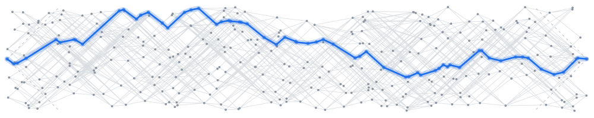

# lpaiu-cs

**Knowledge systems · Cognition · Physics**

Computer Science & Engineering @ Korea University · Seoul, Korea

 

---

## About

I'm a Computer Science student specializing in AI. I'm interested in how humans and AI systems reason, remember, and form knowledge, and in turning these ideas into structured knowledge systems and AI agents.

 

## Interests

**🧠 Agent memory & knowledge systems** &nbsp;→&nbsp; [osk-system](https://github.com/lpaiu-cs/osk-system) 
How agents retain, retrieve, and revise knowledge over long-running work — through structured memory, source grounding, and human review. 
구조화된 기억, 출처 근거, 사람의 검토를 통해 에이전트가 장기 작업에서 지식을 유지·인출·수정하는 방식.

**🤖 Cognitive architectures & context engineering** &nbsp;→&nbsp; [agent-agora](https://github.com/lpaiu-cs/agent-agora) · [latent-delegation](https://github.com/lpaiu-cs/latent-delegation) 
Long-horizon agents with structured memory graphs, reflection, retrieval and social state modeling. 
초장기 실행 에이전트를 위한 구조화된 기억, 성찰, 인출, 사회적 상태 모델링.

**♟ Intelligent systems** &nbsp;→&nbsp; [ModalChess](https://github.com/lpaiu-cs/ModalChess) · [lolChess](https://github.com/lpaiu-cs/lolChess) 
Search, adaptation, and deterministic game AI. 
탐색과 적응, 결정론적 게임 AI.

**🌌 Physics** &nbsp;→&nbsp; [causal-spacetime](https://github.com/lpaiu-cs/causal-spacetime) · [entropy-arrow](https://github.com/lpaiu-cs/entropy-arrow) · [self-mass-unobservability](https://github.com/lpaiu-cs/self-mass-unobservability) 
Spacetime, causality, and the structure of the physical world. 
시공간과 인과성, 그리고 물리적 세계의 구조.

 

## Open source

**[edwardkim/rhwp](https://github.com/edwardkim/rhwp)** — HWP viewer & editor in Rust + WebAssembly 

 

Header: 360 events sprinkled into a strip of 1+1 Minkowski spacetime, time running left to right with light cones at 45°. A signal runs along the longest chain between the two end events (61 events). See <a href="https://github.com/lpaiu-cs/causal-spacetime">causal-spacetime</a>.

